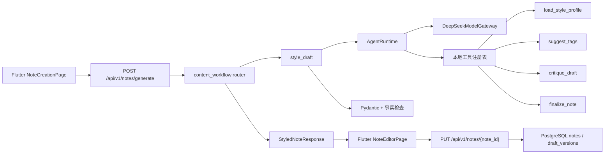

# Red Book Editor Agent 演进路线

> 文档用途：作为 `red_book_editor` 项目的 Agent 学习、开发和复盘主文档。
>
> 当前版本：v0.1
>
> 建立日期：2026-08-15
>
> 分析项目：`/Users/loop/Desktop/My Work/client/red_book_editor`

## 1. 文档目标

这份文档把当前项目的 Agent 分析整理成可执行的开发路线。后续每次开发完成后，都应同步更新：

- 当前状态；
- 已解决的问题；
- 新增的设计决策；
- 验收结果；
- 评测数据和失败案例。

本阶段作为项目演进记录，随每个 OpenSpec change 更新实际实现状态。

## 2. 结论摘要

当前项目已经具备一个不错的 Agent 学习地基，但它目前更准确的定位是：

> 面向小红书育儿文案的风格转换工作流 Agent。

它还不是通用型 Agent，也不应该马上扩展成多 Agent、复杂 RAG 或自动发布系统。

当前最重要的问题不是“缺少多少 AI 能力”，而是以下四件事：

1. 生成、保存、审核存在两套不一致的服务端路径。
2. 事实检查只能确认“来源事实出现了”，不能确认“没有添加来源之外的事实”。
3. Agent Loop 只有最大步数，没有真正的修订次数、工具次数和状态控制。
4. 评测已有案例和运行记录，但还没有形成自动化质量门禁。

推荐演进顺序：

```text
统一 API / 持久化
    ↓
事实账本与结构化输出
    ↓
分层安全审核
    ↓
有状态 Agent Workflow
    ↓
Flutter 流式 AI 体验
    ↓
账号 Memory
    ↓
RAG
    ↓
MCP
```

## 3. 当前项目结构

项目根目录：

```text
/Users/loop/Desktop/My Work/client/red_book_editor
```

主要目录：

```text
client/
  Flutter 客户端
  packages/app_core/          API Client、跨端模型、本地草稿
  packages/note_creation/     输入页面、编辑页面、Agent trace 展示

server/
  Python/FastAPI 服务端
  src/.../domain/              领域契约、Agent Runtime、端口
  src/.../infrastructure/      DeepSeek 网关、数据库模型
  src/.../modules/content_workflow/
                               内容生成、审核、风格 Agent
  src/.../style_profiles/      YAML 风格档案
  tests/                       单元测试和集成测试
  evals/agent_baseline/        Agent 评测案例、运行记录、评分规则

openspec/
  历史变更、设计决策和规格文件
```

## 4. 当前 Agent 链路

### 4.1 主要生成链路

Flutter 当前从 `NoteCreationPage` 进入：



### 4.2 Agent Runtime 当前行为

当前 `AgentRuntime` 的循环是：

```text
system prompt + user prompt
    ↓
调用模型
    ↓
模型返回文本或工具调用
    ↓
服务端执行白名单工具
    ↓
工具结果回填 messages
    ↓
再次调用模型
    ↓
最终 JSON 校验
    ↓
成功返回，或在 max_steps 后失败
```

当前实现位置：

```text
server/src/red_book_editor_server/domain/agent.py
```

当前具备：

- Provider 无关的 `ModelGateway`；
- 手写 Agent Loop；
- 工具白名单；
- 工具结果回填；
- 最大步骤限制；
- 最终结构化输出校验；
- Agent trace 摘要。

当前缺少：

- 独立的修订次数限制；
- 独立的工具调用次数限制；
- 同一错误重复检测；
- Agent 运行状态持久化；
- 取消、恢复和断点续跑；
- 每阶段预算和超时；
- token、成本和模型版本信息。

## 5. Flutter 与 Python 服务端职责边界

### 5.1 Flutter 客户端应该负责什么

Flutter 当前以及未来应该负责：

- 收集用户的 SourceExperience；
- 选择表达形式；
- 选择和上传素材；
- 保存未完成的本地输入；
- 展示 Agent 运行进度；
- 展示草稿和审核提示；
- 允许用户编辑、接受、拒绝和恢复版本；
- 发起字段级重生成；
- 复制内容和记录发布结果。

Flutter 不应该负责：

- 保存模型 API Key；
- 拼接系统 Prompt；
- 决定事实是否可信；
- 执行内容安全审核；
- 直接调用模型供应商；
- 直接执行 Agent 工具；
- 判断内容是否可以导出或发布。

### 5.2 Python 服务端应该负责什么

服务端应该负责：

- 读取账号和栏目上下文；
- 管理 Source Fact Ledger；
- 管理 Prompt、风格档案和模型配置；
- 调度 Agent Workflow；
- 执行工具白名单；
- 进行结构化输出校验；
- 进行事实、风险和安全审核；
- 管理 Agent Run 状态；
- 持久化笔记、版本、审核结果和运行摘要；
- 记录模型、工具、耗时和评测信息。

### 5.3 当前职责边界中的问题

当前存在两套生成路径：

#### 路径 A：Flutter 实际使用的生成路径

```text
POST /api/v1/notes/generate
```

特点：

- 不读取数据库中的账号和栏目；
- 不创建 `NoteModel`；
- 不执行最终 `review_draft`；
- 返回一个新生成的 `note_id`；
- 返回一次性 trace。

#### 路径 B：服务端持久化生成路径

```text
POST /api/v1/accounts/{account_id}/notes
```

特点：

- 校验账号和栏目；
- 可以读取账号定位和栏目说明；
- 生成后持久化；
- 执行审核；
- 创建第一条草稿版本。

这两条路径应该收敛为同一个 Application Service，而不是继续在两个 Router 中分别维护逻辑。

## 6. 已确认的问题清单

### P0-01：生成结果可能无法保存

`/api/v1/notes/generate` 生成了新的 `note_id`，但没有写入 `NoteModel`。Flutter 后续使用 `PUT /api/v1/notes/{note_id}` 保存时，可能得到 `note_not_found`。

验收标准：

```text
生成 → 编辑 → 保存 → 草稿列表 → 重新打开
```

整条链路可以成功完成。

### P0-02：主要生成路径绕过最终审核

风格 Agent 输出的草稿默认为 `ready`，`review=None`。这会导致风险内容可能直接进入可复制或可导出状态。

验收标准：

- 所有生成路径都执行同一个审核服务；
- blocking 风险必须阻止导出；
- warning 风险必须进入 `needs_review` 或展示明确提示；
- 任何没有审核结果的草稿不能被标记为 `ready`。

### P0-03：事实检查不能阻止新增事实

当前事实检查主要是字符串包含判断。它可以检查来源事实是否出现，但不能检查模型是否增加了来源没有提供的内容。

需要区分：

```text
Source Fact：用户明确提供的事实
Unknown：用户没有提供的信息
Generated Style：允许的表达变化
Unsupported Claim：来源没有支持的结论
```

### P0-04：Prompt 中的修订上限没有落实到代码

Prompt 中要求最多修订 2 轮，但 Runtime 只限制总步数。案例 4 已经出现因重复批评和修订而 `agent_max_steps` 的情况。

需要增加：

- `max_revisions`；
- `max_tool_calls`；
- `max_same_error`；
- 每个阶段的超时；
- 重复工具调用检测。

### P1-01：字段重生成仍然生成整篇文案

当前请求标题重生成时，服务端仍会重新执行完整风格 Agent，然后只取标题字段。应改成字段级任务，明确要求只返回目标字段。

### P1-02：重新打开草稿后可能丢失表达形式

持久化内容中写入了 `style_form`，但对外 DTO 和 Flutter `NoteDraft` 没有保留它。重新打开草稿后，字段重生成可能无法知道原来的表达形式。

### P1-03：Trace 只能在请求完成后展示

当前 trace 没有运行 ID、事件流、取消、恢复和持久化。它适合学习和调试，不足以支撑长耗时 Agent 产品体验。

### P1-04：素材上传了，但 Agent 没有真正使用素材

当前 `SourceExperience` 只把 `asset_ids` 传给服务端。Agent 没有读取图片内容，也没有对图片和生成建议建立绑定关系。

后续应明确区分：

- 用户实际拥有的素材；
- Agent 提议的配图；
- 需要用户确认的视觉判断。

### P1-05：账号上下文没有进入 Flutter 的主生成路径

账号和栏目数据已经存在数据库，但 Flutter 主流程使用固定的 account ID 和 column ID，且 `/notes/generate` 没有加载对应上下文。

### P1-06：当前评测尚未成为质量门禁

已有：

- 5 个脱敏案例；
- 重复运行记录；
- 人工评分规则；
- 硬失败标签。

缺少：

- 自动硬失败检测；
- 自动事实覆盖率；
- Prompt 和 Profile 版本；
- token 和成本；
- 失败原因分类；
- 人工最终修改稿；
- baseline 汇总报告。

## 7. 各 AI 能力的适配判断

### 7.1 Context

适合度：非常高，应该优先做。

当前 Agent 每次调用都把完整 messages 传给模型，但业务上下文没有形成结构化对象。建议增加：

```text
AgentContext
- source_facts
- account_profile
- column_profile
- style_profile
- current_draft
- user_edits
- review_findings
- execution_budget
```

这样工具不需要每次让模型重复传递完整 source 和 draft，也能减少上下文污染。

### 7.2 Memory

当前没有长期 Memory。不要一开始做成泛化聊天记忆，先做领域 Memory：

1. 账号定位、语气、禁用表达；
2. 用户主动接受或拒绝过的修改；
3. 历史发布内容；
4. 用户确认过的高质量版本。

Memory 必须由业务事件显式写入，不能让模型自动把所有对话内容都保存下来。

### 7.3 Structured Output

当前只有最终 JSON 是结构化的。下一步应将每个阶段都结构化：

```text
PlanResult
DraftContent
CritiqueResult
ClaimAudit
SafetyReview
FinalNote
```

最终输出至少要校验：

- `form` 与用户选择一致；
- 所有必填字段存在；
- 数组长度合法；
- 来源事实有对应关系；
- 未通过审核时不能进入 `ready`；
- 不能把 tool result 当成最终业务结果直接信任。

### 7.4 Tool Calling

当前的 4 个工具是本地 Python 函数：

```text
load_style_profile
suggest_tags
critique_draft
finalize_note
```

这是合理的学习起点。下一阶段不要盲目增加工具，应先补齐：

- Pydantic 参数校验；
- 工具超时；
- 工具调用预算；
- 错误类型；
- 只读和写操作分类；
- 写操作的用户确认；
- 幂等键和审计信息。

适合新增的只读工具：

- `get_account_context`；
- `get_source_facts`；
- `search_published_notes`；
- `get_note_versions`；
- `search_style_examples`。

### 7.5 RAG

当前没有 RAG，也没有向量检索依赖。RAG 不应该用来保存本次用户经历的事实，本次事实应以 Fact Ledger 为准。

适合 RAG 的内容：

- 用户自己发布过的历史笔记；
- 用户人工确认过的高质量笔记；
- 账号风格规范；
- 经审核的育儿知识资料；
- 平台内容规范。

推荐顺序：

```text
PostgreSQL 全文检索
    → 账号范围隔离
    → 混合检索
    → 向量检索
    → 引用和来源展示
```

### 7.6 Agent Loop

当前通用 Runtime 适合学习底层机制，但内容生成不应完全依赖模型自由决定流程。建议变成有限状态工作流：

```text
collect_context
    → draft
    → critique
    → revise
    → safety_review
    → finalize
```

阶段转换由服务端控制，模型负责阶段内的语言生成和判断。

### 7.7 MCP

当前没有 MCP。MCP 应作为工具互操作层，而不是 Agent 智能本身。

建议等内部 Tool 协议稳定后，再接入只读 MCP：

- 查询账号画像；
- 查询历史笔记；
- 查询素材；
- 查询评测案例；
- 查询审核规则。

暂时不要通过 MCP 开放自动保存、自动发布、删除素材等写操作。

### 7.8 Evaluation / Observability

现有评测目录是很好的起点。每次运行建议记录：

```text
run_id
case_id
model
prompt_version
profile_version
elapsed_ms
tool_call_count
revision_count
input_tokens
output_tokens
status
hard_failures
final_edited_draft
```

建议将以下情况设置为自动硬失败：

- 未知药名、剂量、疗程；
- 未提供的医生或专家背书；
- “绝对安全”“适合所有宝宝”；
- 危险睡眠方式的可复制建议；
- 未提供的宴会、产品或结果细节；
- Agent 达到最大步数；
- 最终输出结构不合法。

### 7.9 Guardrails

Guardrails 应分成多层：

```text
输入层：识别敏感信息和提示注入
    ↓
事实层：Source Fact Ledger
    ↓
结构层：Pydantic / JSON Schema
    ↓
领域层：医疗、睡眠、产品安全规则
    ↓
输出层：review + export gate
    ↓
人工层：warning / blocking 的用户确认
```

Prompt 只能作为行为指导，不能作为最终安全边界。最终安全边界必须在服务端代码和审核状态中实现。

### 7.10 Flutter AI Native 能力

Flutter 当前已经具备：

- 本地输入恢复；
- Agent trace 展示；
- 字段级重生成入口；
- 草稿版本；
- 手动复制和人工发布边界。

下一步建议增加：

- 流式阶段进度；
- 取消生成；
- 失败后恢复；
- 草稿与用户编辑 Diff；
- 接受/拒绝单条建议；
- 字段的来源事实展示；
- 审核命中内容高亮；
- 账号和栏目上下文选择；
- 重新打开草稿时保留 `style_form`。

## 8. 分阶段开发路线

### Milestone 0：统一生成与持久化链路（已完成）

目标：先让现有产品链路可靠。

开发任务：

- [x] 创建 `ContentGenerationService`，收敛两个 Router 的重复逻辑。
- [x] 统一生成接口是否立即创建 `NoteModel`。
- [x] 修复生成后保存可能 `note_not_found` 的问题。
- [x] 所有生成路径统一执行审核。
- [x] `NoteDraftDto` 和 Flutter `NoteDraft` 增加 `style_form`。
- [x] 生成时读取账号定位、语气和栏目说明。
- [x] 增加生成、保存、列表、重新打开、字段重生成的端到端测试。

完成标准：

```text
用户输入经历
→ 生成草稿
→ 保存
→ 草稿列表可见
→ 重新打开
→ 保留风格
→ 局部重生成仍使用正确模型和风格
```

### Milestone 1：可靠事实与安全边界（本 change 已完成）

目标：防止“文案好看但事实不可靠”。

开发任务：

- [x] 增加 `FactLedger`。
- [x] 将 scenario、actions、observations、数字和实体拆成事实项。
- [x] 增加 `ClaimAudit`。
- [x] 区分 supported、unsupported、uncertain。
- [x] 最终输出校验 `form`。
- [x] `critique_draft` 存在关键 issue 时不得返回 passed。
- [x] 增加医疗、睡眠、产品安全规则。
- [ ] 清理风格 YAML 中容易导致虚构的具体背书和功效示例。
- [x] 将审核结果真正连接到 `NoteStatus` 和 export gate。

完成标准：

- 来源外新增事实被识别；
- 危险建议进入 blocking；
- 不确定内容进入 needs_review；
- 没有 review 的内容不能标记为 ready；
- 5 个 baseline 案例可以自动输出硬失败标签。

### Milestone 2：有状态 Agent Workflow

目标：让 Agent 可控、可观察、可取消，并能在服务端重启后识别和恢复运行。

开发任务：

- [x] 增加 `AgentRun` 与有序 `AgentRunEvent` 持久化。
- [x] 增加阶段状态：`collect_context`、`draft`、`critique`、`revise`、`safety_review`、`finalize`。
- [x] 增加 `max_revisions`、`max_tool_calls`、`max_same_error`。
- [x] 增加每阶段超时和总步骤保护。
- [x] 增加取消、失败、完成和中断状态。
- [x] 失败时保留可展示的部分 trace、运行状态和稳定失败原因。
- [x] 将 Runtime 事件与客户端 SSE 展示事件分开，并支持断线游标续读。

完成标准（`milestone-2-agent-runtime-workflow` + `milestone-2-agent-run-lifecycle`）：

- Agent 不会无限重复同一问题；
- 超时、预算耗尽和最终校验失败不会返回成功结果；
- 评测记录包含阶段、计数器和稳定失败代码；
- 现有同步 API、Fact Ledger、Claim Audit 和导出门禁语义保持不变；
- 用户可以查询运行状态、订阅阶段事件、取消运行，并从中断/失败状态重新执行；
- 服务端重启后未完成运行会被标记为 `interrupted`，而不是静默丢失。

本轮恢复是基于已持久化笔记输入的重新执行，不是模型上下文 checkpoint；多副本分布式 worker 锁和 token 级流式输出留待后续架构迭代。

### Milestone 3：Flutter AI Native 体验

目标：从“点击生成”升级为“用户参与生成”。

开发任务：

- [x] API Client 支持 AgentRun SSE 事件、断线游标续读和去重。
- [x] 增加生成进度组件。
- [x] 增加取消按钮。
- [x] 增加失败重试和继续运行。
- [x] 增加 AI 初稿、当前编辑和候选建议之间的字段 Diff。
- [x] 增加字段级建议的接受/拒绝和基础冲突确认。
- [x] 字段重生成接口只返回目标字段 `FieldSuggestion`。
- [x] 展示字段对应的来源证据和审核摘要。
- [x] 审核问题定位到字段和命中文本，不伪造字符偏移。

完成标准：

```text
生成过程中用户知道 Agent 正在做什么
用户可以停止、重试、继续运行、查看 Diff、接受或拒绝字段建议；采纳和保存仍受完整审核与导出门禁约束
用户可以看到内容与来源事实的关系
用户修改后的内容不会被无意覆盖
```

### Milestone 4：账号 Memory

目标：让 Agent 越来越了解当前账号，但不随意保存私人信息。

开发任务：

- [ ] 账号风格记忆。
- [ ] 用户接受/拒绝修改的偏好记忆。
- [ ] 历史高质量笔记。
- [ ] 发布后的数据回流。
- [ ] Memory 的显式查看、编辑和删除。

完成标准：

- Memory 有明确来源；
- 用户可以修改和删除；
- 不保存不必要的儿童敏感信息；
- 生成结果能说明使用了哪些账号偏好。

### Milestone 5：RAG 和 MCP

目标：在基础 Agent 稳定之后扩展知识和工具边界。

开发任务：

- [ ] 历史笔记全文检索。
- [ ] 账号范围隔离。
- [ ] 维护经审核的知识资料。
- [ ] 为检索结果提供来源和引用。
- [ ] 建立 MCP Tool Provider 适配层。
- [ ] 先开放只读工具。
- [ ] 写操作增加用户确认、权限、幂等和审计。

完成标准：

- RAG 结果可以追溯到原始资料；
- 不同账号之间不会检索到彼此内容；
- MCP 工具不会绕过服务端权限和审核；
- Agent 不能因为工具调用而自动发布内容。

## 9. 建议的开发顺序

按照每天 5～6 小时投入，建议按以下顺序推进：

### 第 1 轮：可靠性

1. 修复生成后保存问题。
2. 统一两套生成路径。
3. 接通最终审核。
4. 保存和恢复 `style_form`。
5. 补端到端测试。

### 第 2 轮：事实和安全

1. 设计 Fact Ledger。
2. 修改最终输出结构。
3. 增加 Claim Audit。
4. 增加硬失败规则。
5. 重跑 baseline。

### 第 3 轮：Agent Workflow

1. 增加阶段状态、预算和循环保护（第一片已完成）。
2. 增加 AgentRun 持久化。
3. 改造 trace 为内部事件和客户端展示事件。
4. 增加取消、恢复和断点续跑。

### 第 4 轮：客户端 AI Native

1. 流式阶段展示。
2. 字段级重生成。
3. Diff 和建议采纳。
4. 来源事实展示。
5. 审核问题定位。

### 第 5 轮：Memory / RAG / MCP

只在前四轮稳定之后开始。

## 10. 开发过程中的质量门禁

每次修改 Agent 行为时，至少执行：

```text
单元测试
→ API 契约测试
→ 端到端生成保存测试
→ 5 个 baseline 案例
→ 人工检查硬失败
→ 记录版本和失败原因
```

每次模型、Prompt、风格档案或审核规则变化，都应记录：

```text
变更内容
变更原因
影响案例
旧结果
新结果
是否引入新风险
```

## 11. 暂时不做的事情

当前阶段暂不优先：

- 多 Agent 协作；
- LangGraph 等编排框架；
- 自动发布到小红书；
- 无来源的互联网实时热点检索；
- 复杂向量数据库；
- 自动保存所有聊天内容；
- 通过 MCP 开放写操作；
- 让模型直接决定安全状态。

原因是：这些能力建立在事实、状态、审核和评测稳定的基础上。基础不稳定时，增加更多工具只会放大问题。

## 12. 后续迭代记录

每次开发完成后，在这里追加一条：

```markdown
### YYYY-MM-DD：本次迭代标题

#### 目标

-

#### 修改内容

-

#### 验证结果

-

#### 评测变化

- 通过案例：
- 失败案例：
- 新增风险：

#### 下一步

-
```

## 13. 当前下一步

Milestone 0、Milestone 1、Milestone 2 和 Milestone 3 已完成。当前仍未覆盖：

1. `P1-04`：Agent 对图片素材的实际理解和素材绑定；
2. `P1-06`：自动评分、成本/Token 记录和完整质量门禁；
3. 更丰富的多候选历史、跨设备建议恢复，以及字符/富文本级精确 Diff。

下一步评估图片理解、Token/成本记录和质量门禁，再决定是否进入 RAG、MCP 或 Memory。自动发布仍不在范围内。
